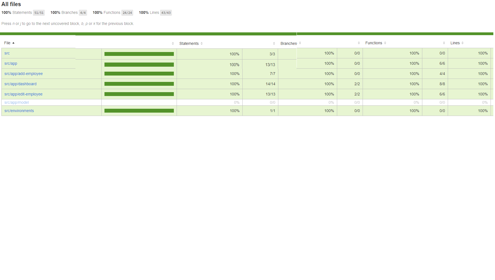
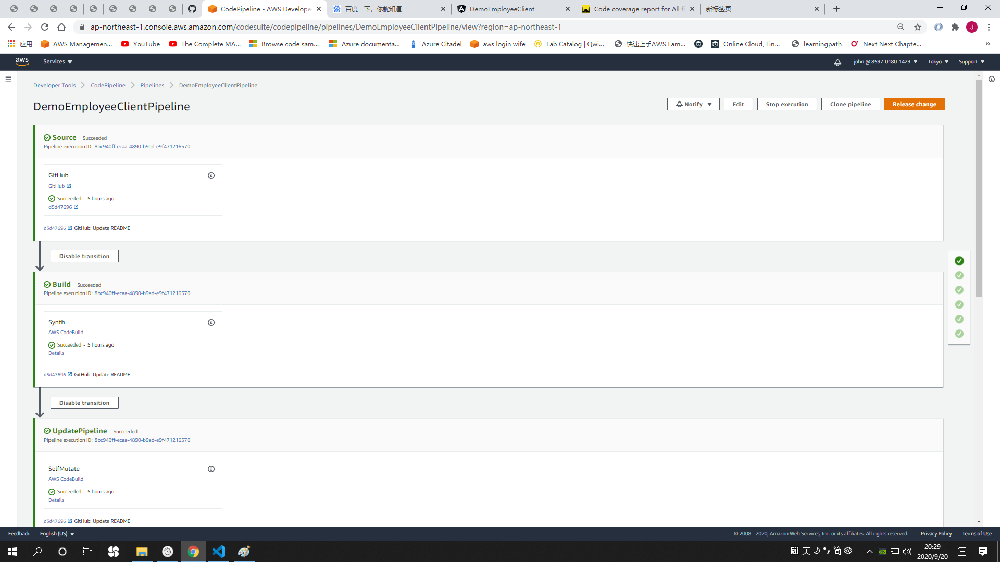
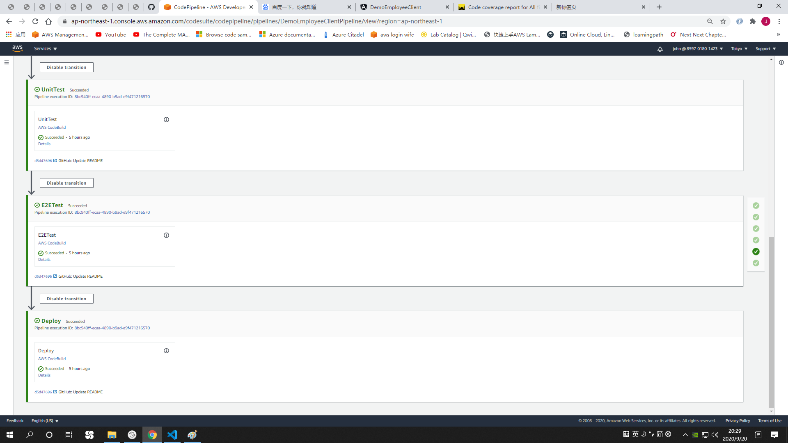

# Welcome. This project include an angular application, CICD pipeline created with AWS CDK and deployed to AWS S3 bucket.
Preview: http://demo-employee-client-121.s3-website-ap-northeast-1.amazonaws.com

## Application architecture
The architecture is Angular as client and it's served by AWS S3 website bucket, backend is AWS API Gateway + Lambda + Dynamodb.
CICD pipeline is defined by AWS CDK using AWS Code pipeline, AWS Code build to build and test application.

## Test coverage report


## Pipeline screenshot



## Local setup
* Install aws cli and configure aws cli, https://docs.aws.amazon.com/cli/latest/userguide/install-cliv2.html
* Install aws cdk
```
npm install -g aws-cdk
```
* Bootstrap cdk environment
```
cdk bootstrap     [--profile admin-profile-1]     --cloudformation-execution-policies arn:aws:iam::aws:policy/AdministratorAccess
```
* Update repoOwner, repo and websiteBucketName in cdk.json
```
    "repoOwner": "JohnLiTangshan",
    "repo": "demo-employee-client",
    "websiteBucketName": "demo-employee-client-121"
```
* Create a github token in AWS secret manager named githubToken
## The angular application
The angular application source code is in app folder, it includes application code, Unit testing, E2E testing
## To deploy the application
* Run below command to create the Pipeline in aws
```
    cdk deploy
```
* You only need to run above command once, it will create Code pipeline and the website bucket. The pipeline will Build, Unit Test, E2E test and deploy angular application to S3 Bucket
* Later when you commit code to master branch, the pipeline will deploy the application automatically.

## How the pipeline defined
The pipeline is defined is lib/pipeline-stack.ts file.

The `cdk.json` file tells the CDK Toolkit how to execute your app.

## Useful commands

 * `npm run build`   compile typescript to js
 * `npm run watch`   watch for changes and compile
 * `npm run test`    perform the jest unit tests
 * `cdk deploy`      deploy this stack to your default AWS account/region
 * `cdk diff`        compare deployed stack with current state
 * `cdk synth`       emits the synthesized CloudFormation template
